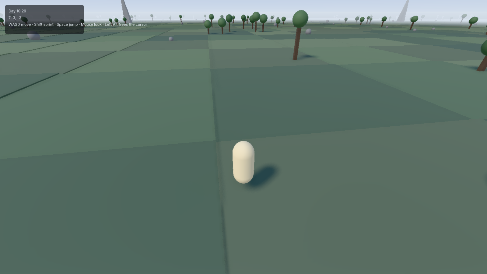
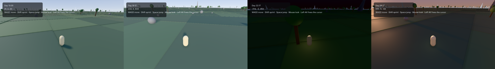

**A standalone, open-source game engine scripted in Luau — built for developers coming from Roblox.**

LuauG gives you the developer experience you already know — `Instance` trees, `game:GetService`, `task.spawn`, signals with `:Connect` — in an independent, professional engine: a modern C++ core embedding the Luau VM directly, a data-oriented ECS behind a familiar Instance facade, a swappable renderer and physics stack, deterministic fixed-tick simulation, and a code-first workflow (VS Code + CLI + sub-second hot reload). It targets complete 2D and 3D games, from small scenes to huge streamed open worlds, on desktop first, then mobile, with a console-ready architecture.

> **STATUS: M8 built, awaiting human review.** Ten of the eleven milestones are
> signed off; the last one is written up and waiting for somebody to play it.
> A milestone is complete when the human says so and not when a gate goes green
> (`MASTER_PROMPT.md` §6), and M4 is why that is spelled out. The engine boots a sandboxed Luau VM, opens a window, runs a
> deterministic fixed-tick simulation over an Instance tree on an ECS,
> hot-reloads a saved script into a new world in under two milliseconds, renders
> a world with cascaded shadows, clustered lights, image-based lighting and a
> post chain, simulates a thousand active rigid bodies in two milliseconds a
> tick, streams a world larger than it holds, and packages a game into a folder
> you can send to somebody.
>
> **The deliverable is [`examples/10-open-world`](examples/10-open-world/)**: a
> third-person character walking four and a half kilometres of streamed terrain
> under a sun that crosses the sky, with a HUD, ambient sound, physics, and hot
> reload that puts you back where you were standing. A ten-minute soak of it at
> 1080p on the reference machine holds a **median of 5.35 ms** — one frame in
> 35,939 misses 60 fps — with memory flat and zero streaming hitches.
>
> **The review gate is not ceremony, and M8 is the best evidence yet.** Four of
> this milestone's defects came from a human running the flagship and saying what
> bothered them, while every gate in the repository was green: the world
> vibrating as you walk (the renderer never interpolated between ticks, and the
> scheduler had computed the factor for it since M1), the shadows crawling (three
> causes, the root being a character sliding off a tile corner), a pointer lock
> that was stored and read by nothing, and a camera that turned the way you did
> not push.
>
> It is written autonomously, milestone by milestone, by an AI agent (Claude
> Opus, multi-agent orchestration) following [`MASTER_PROMPT.md`](MASTER_PROMPT.md),
> with a human review gate at the end of every milestone.

  

  
   <em>One world, one property: <code>Lighting.ClockTime</code> drives the sky, the shadows, the fog and the exposure.</em>

## Where it is

| | Milestone | Gate |
|---|---|---|
| ✅ | **M0** — bootstrap: sandboxed VM, i18n'd log, pinned toolchain | signed off, `milestone/m0` |
| ✅ | **M1** — window, RHI (SDL3 GPU / capture / null), fixed-tick loop, screenshot + capture harness | signed off, `milestone/m1` |
| ✅ | **M2** — the kernel: ECS, Instance facade, deferred signals, `task`, services, world hash | signed off, `milestone/m2` |
| ✅ | **M3** — `luaug` CLI, hot reload, generated type definitions, conformance runner | signed off, `milestone/m3` |
| ✅ | **M4** — meshes, materials, camera, lighting; RHI interface freeze (ADR 0037) | signed off, `milestone/m4` |
| ✅ | **M4.5** — correcting the environment the renderer never read, and what was found beside it | signed off, `milestone/m4.5` |
| ✅ | **M5** — Jolt physics, queries, welds, and a character you can steer | signed off, `milestone/m5` |
| ✅ | **M6** — input actions, UI, tweens, audio, minimal animation; `examples/04-obby` | signed off, `milestone/m6` |
| ✅ | **M7** — asset pipeline, async IO, streaming, floating origin | signed off, `milestone/m7` |
| ✅ | **M7.5** — cascaded shadows, clustered lights, image-based lighting, post | signed off, `milestone/m7.5` |
| 🔨 | **M8** — the flagship open-world demo, hardening, docs, v1.0 | awaiting review |

**What runs today.** `luaug new` scaffolds a project; `luaug dev` runs it with a
watcher, so a saved file rebuilds the world without the window closing;
`luaug build` turns it into a folder that runs on a machine with none of this
installed, wearing the game's own icon. In between: a streamed world of chunks
that arrive before you reach them, over a 64-bit floating origin; forward PBR
with four shadow cascades, clustered lights, image-based lighting from the sky
the engine draws, and a post chain of ambient occlusion, automatic exposure,
bloom and FXAA; Jolt with contacts surfaced as deferred `Touched` signals,
collision groups, queries, welds and a character that climbs, rides platforms and
is stopped by walls; rebindable input actions across keyboard, mouse and gamepad;
a UI tree over `UDim2` layout with real text; tweens, positional audio on the
simulation timeline, and skeletal animation. **1,109** conformance specs written
against [`docs/api-design.md`](docs/api-design.md) — not against the
implementation — pass on Windows and Linux, beside a determinism harness that
replays recorded input and compares world hashes, a capture-stream gate that
compares draw commands rather than pixels, an editor-seam proof that runs two
worlds and two VMs in one process, and a soak that walks the flagship for ten
minutes and asserts the memory curve flattens.

**What it does not have, stated plainly.** No visual editor, no particles, no
decals, no terrain, no `SurfaceGui`, no rich text, no navmesh, no 2D workflow, no
multiplayer, no mobile. Each has an owner in the roadmap's post-v1 phases rather
than a shrug, and
[`docs/coming-from-roblox.md`](docs/coming-from-roblox.md) §5 lists them with
where they went. A `Sound` plays a generated tone rather than a file. A property
the engine stores and does not act on is marked `Inert` in the inspector and the
api-dump, and a gate stops a new one appearing quietly.

## Not affiliated with Roblox

LuauG is an independent project. It is **not** affiliated with, endorsed by, or sponsored by Roblox Corporation. LuauG replicates **public API concepts and idioms only** — it contains **no Roblox source code, no Roblox assets, no Roblox branding**, and it is not derived from any Roblox software. Luau is an open-source language (MIT) created by Roblox and used here under its license. "Roblox" is a trademark of Roblox Corporation, referenced only nominatively.

## Why LuauG

- **Familiar, not identical.** Same concepts and idioms as the platform you came from (`Instance.new("Part")`, `Workspace`, `Touched:Connect(...)`, `TweenService`), but a clean, fully typed, deliberately improved API — deferred-only signals, real file modules instead of ModuleScripts, the modern Input Action System, SI units, `--!strict` everywhere.
- **Optimized by architecture.** Instance tree on the outside, data-oriented ECS on the inside. Native Luau `vector` as `Vector3` (zero-allocation script math). Atom-based property dispatch. Buffer-based bulk APIs. Fixed-tick deterministic simulation with interpolated rendering. Chunked streaming with 64-bit world coordinates and floating origin.
- **Swappable subsystems, sane defaults.** Renderer, RHI backend, physics, audio, and network transport all sit behind explicit seams selected at build time.
- **Open toolchain.** File-based projects, `.luaurc` + require-by-string, full `luau-lsp` support with generated type definitions, `rokit`-pinned tools, `pesde` packages, a CLI (`luaug`) running on the official Lute runtime.

## Default stack (pinned)

| Layer | Choice | License |
|---|---|---|
| Scripting VM | Luau **0.734** (embedded directly, `LUA_VECTOR_SIZE=3`) | MIT |
| Tooling runtime | Lute **1.0.0** (unmodified, CLI/tooling only) | MIT |
| Platform / window / input | SDL **3.4.x** | zlib |
| GPU | Custom RHI → **SDL3 GPU** (default backend); **bgfx** (mobile-phase backend) | zlib / BSD-2 |
| Shaders | HLSL via **SDL_shadercross** → SPIR-V / DXIL / MSL | zlib |
| Physics 3D | **Jolt 5.6** | MIT |
| Physics 2D (post-v1) | **Box2D 3.1** | MIT |
| Audio | **miniaudio 0.11.25** | MIT-0 / Unlicense |
| Assets | fastgltf (+ **simdjson 3.12.3**, its required parser) · meshoptimizer · basis_universal/KTX2 · stb (assimp: offline importer only) | MIT / Apache-2.0 / BSD / PD |
| Debug UI | Dear ImGui (docking) | MIT |
| Navigation (post-v1) | Recast & Detour | zlib |
| Net transport primitives | GameNetworkingSockets · ENet | BSD-3 / MIT |

Everything in the default path is permissively licensed. Exact pinned commits live in [`third_party/manifest.json`](third_party/manifest.json).

## Repository map

- [`MASTER_PROMPT.md`](MASTER_PROMPT.md) — mission constitution for the autonomous builder agent
- [`PROGRESS.md`](PROGRESS.md) — the build ledger (current state, session log)
- [`docs/architecture.md`](docs/architecture.md) — native core architecture (modules, layering, scheduler, ECS bridge, streaming)
- [`docs/api-design.md`](docs/api-design.md) — the Luau-facing API and developer experience
- [`docs/roadmap.md`](docs/roadmap.md) — milestones M0 through M8 with verification gates
- [`docs/decisions/`](docs/decisions/) — architecture decision records (ADRs)
- [`docs/research/`](docs/research/) — frozen research reports (Luau, Lute, ecosystem — August 2026)
- [`docs/coming-from-roblox.md`](docs/coming-from-roblox.md) — the migration guide (habit-by-habit mapping)
- [`docs/api/`](docs/api/) — the API reference, generated from the IDL
- [`CHANGELOG.md`](CHANGELOG.md) — what each release contains
- [`CONTRIBUTING.md`](CONTRIBUTING.md) — how contributions work

## v1 definition of done

A third-person character exploring a large open world with chunk streaming, Jolt physics, a simple day/night cycle, and live hot reload — plus a playable obby example, a physics playground, headless conformance/determinism test suites, and the `luaug` CLI. See [`docs/roadmap.md`](docs/roadmap.md).

## License

[Apache-2.0](LICENSE). See [`NOTICE`](NOTICE) and [`THIRD_PARTY_NOTICES.md`](THIRD_PARTY_NOTICES.md).
